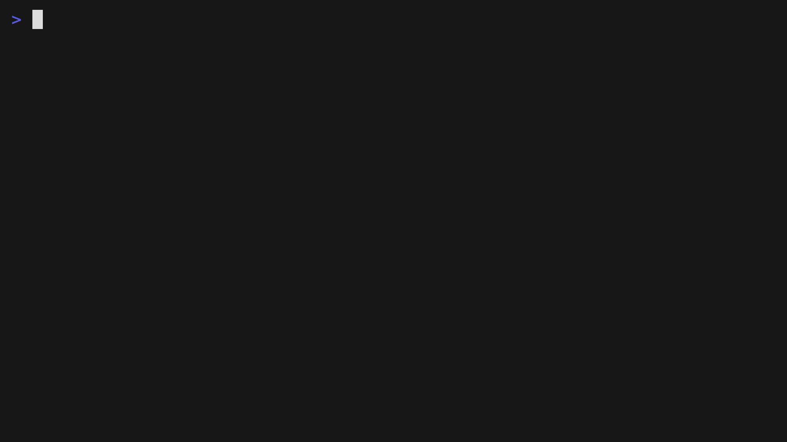

<div align="center">

#  cpx

**Cpx Your Code!** Cargo-like DX for C++: scaffold, build, test, bench, lint, package, and cross-compile with one CLI.

</div>

<p align="center">
  
</p>


[](https://github.com/ozacod/cpx/releases)
[](https://opensource.org/licenses/MIT)


## Overview

cpx is a batteries-included CLI for C++ that pairs an interactive TUI with sensible defaults: CMake presets, vcpkg dependencies, testing, benchmarking, formatting, linting, sanitizers, git hooks, and Docker-based CI targets (including Alpine/musl). Releases embed the tag version directly into the binary so `cpx --version` always matches the downloaded release.

### Highlights
- Interactive `cpx new` TUI:
  - Templates: App or Library
  - Test Frameworks: GoogleTest, Catch2, Doctest
  - Benchmarking: Google Benchmark, Nanobench, Catch2
  - Git Hooks: Auto-configure pre-commit (fmt/lint) and pre-push (test)
- **Smart Add**: `cpx add <pkg>` fetches usage info and auto-injects `find_package` and `target_link_libraries` into `CMakeLists.txt`.
- vcpkg-first workflow with generated `CMakePresets.json`
- Code quality: clang-format, clang-tidy, Cppcheck, Flawfinder
- Sanitizers: ASan, TSan, MSan, UBSan
- CI and cross-compilation: Docker targets for linux-amd64/arm64, macOS (placeholder), windows-amd64, plus Alpine musl images
- Self-updating installer and `cpx upgrade`


## Install

### One-liner (recommended)
```bash
curl -fsSL https://raw.githubusercontent.com/ozacod/cpx/master/install.sh | sh
```
The installer downloads the latest release for your platform, sets up (or reuses) vcpkg, drops Dockerfiles into `~/.config/cpx/dockerfiles`, and ensures `cpx` is on your PATH.

### Manual
1) Download the right asset from [Releases](https://github.com/ozacod/cpx/releases/latest).  
2) Install it:
```bash
chmod +x cpx-<os>-<arch>
mv cpx-<os>-<arch> /usr/local/bin/cpx
```
3) Point cpx to vcpkg:
```bash
cpx config set-vcpkg-root /path/to/vcpkg
```

## Upgrade
```bash
cpx upgrade
```
Uses the latest GitHub release and replaces the current binary. The version flag is embedded at build time.

## Quick start
```bash
cpx new            # interactive project scaffolding
cd <project>
cpx build          # or: cpx build --release
cpx run            # run the app
cpx test           # run tests
cpx bench          # run benchmarks
cpx fmt            # format
cpx lint           # clang-tidy
cpx add fmt   # adds dependency and updates CMakeLists.txt
```

## Command sampler
- Project: `cpx new`, `cpx add <pkg>` (Smart Add), `cpx remove <pkg>`, `cpx search <term>`, `cpx list`, `cpx info <pkg>`
- Build/run/test: `cpx build [--release|-j 8|--asan|--tsan|--msan|--ubsan]`, `cpx run [--release]`, `cpx test [--filter <name>]`, `cpx bench [--verbose]`, `cpx check`
- Quality: `cpx fmt [--check]`, `cpx lint [--fix]`, `cpx flawfinder [--html|--csv|--dataflow]`, `cpx cppcheck [--xml|--enable <checks>]`
- Hooks: `cpx hooks install` (manual refit)
- Versioning: `cpx release <major|minor|patch>` (updates `CMakeLists.txt` and `version.hpp` if present)
- CI: `cpx ci [--target <name>] [--rebuild]`
- Utilities: `cpx config set-vcpkg-root <path>`, `cpx upgrade`, `cpx doc`

## Cross-compilation & CI
`cpx ci` reads `cpx.ci` and builds Docker targets. Sample targets include:
- `Dockerfile.linux-amd64`, `Dockerfile.linux-arm64`
- `Dockerfile.linux-amd64-musl`, `Dockerfile.linux-arm64-musl`
- `Dockerfile.windows-amd64`
- `Dockerfile.macos-*` (placeholders until an osxcross toolchain is provided)

## Project layout (generated)
```
my_project/
├── CMakeLists.txt
├── CMakePresets.json
├── vcpkg.json
├── cpx.ci               # optional CI targets
├── include/<name>/
│   ├── <name>.hpp
│   └── version.hpp      # generated with version macros
├── src/
├── tests/
├── bench/               # optional benchmarks
└── build/               # gitignored
```

## Build from source
Prereqs: Go 1.21+ and vcpkg.  
```bash
cd cpx
go build -o cpx ./cmd/cpx   # current platform
```
Release builds inject the tag version via `-ldflags "-X github.com/ozacod/cpx/internal/app/cli.Version=<tag>"`.

## Docs
- Releases: [github.com/ozacod/cpx/releases](https://github.com/ozacod/cpx/releases)

## Contributing
Issues and PRs are welcome.

## License
MIT. See [LICENSE](LICENSE).
